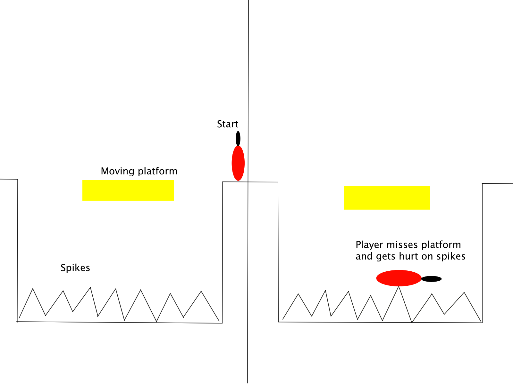
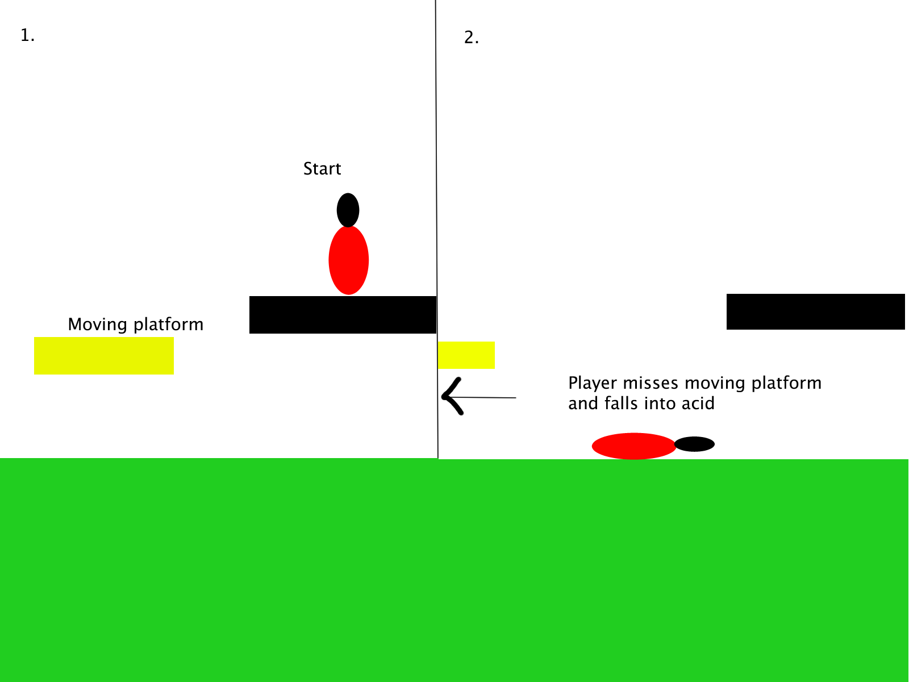
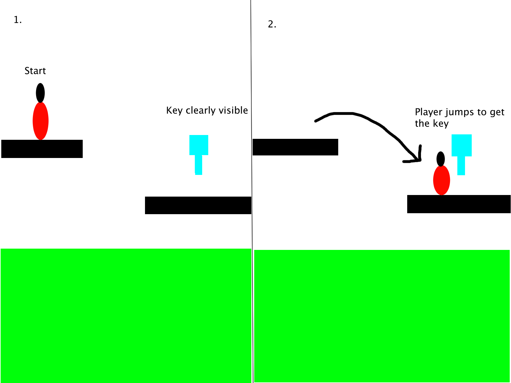
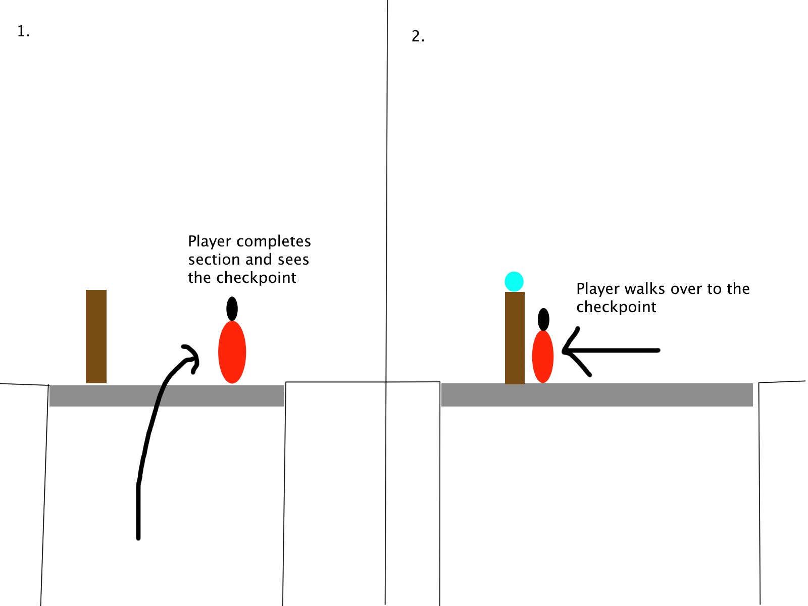
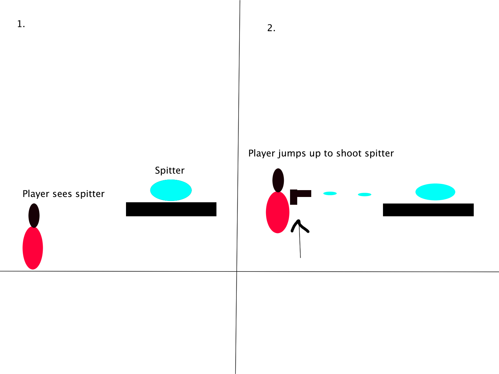
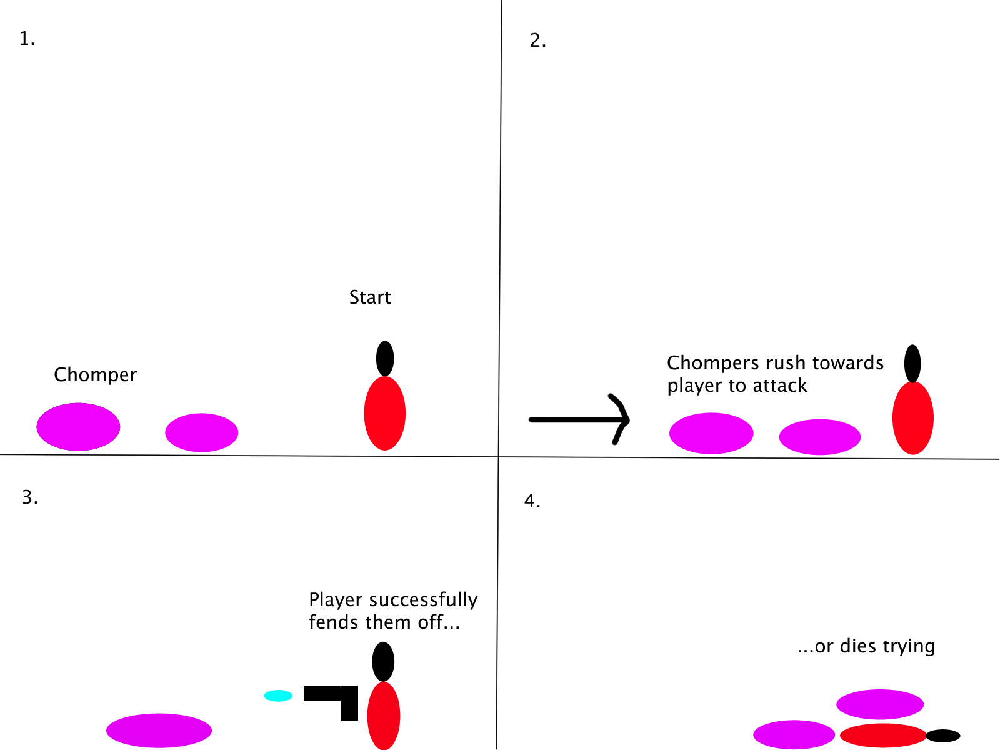

[](https://classroom.github.com/a/YyUO0xtt)
# COMP2150  - Level Design Document
### Name: [your name]
### Student number: [your student number] 

This document discusses and reflects on the design of your platformer level for the Level Design assessment. It should be 1500 words. Make sure you delete this and all other instructional text throughout the document before checking your word count prior to submission. Hint: You can check word count by copying this text into a Word or Google doc.

Your document must include images. To insert an image into your documentation, place it in the "DocImages" folder in this repo, then place the below text where you want the image to appear:

```

```

Example:


## 1. Player Experience (~700 words)
Outline and justify how your level design facilitates the core player experience goals outlined in the assignment spec. Each section should be supported by specific examples and screenshots of your game encounters that highlight design choices made to facilitate that particular experience.

### 1.1. Discovery
What does the player learn? How does your encounter and broader level design facilitate learning in a way that follows good design practice?

As the player makes progress throughout my game, the player learns to use the weapons and tools in their arsenal as well as their wits to overcome the many challenges that stand in their way. Throughout their journey, the player learns to utilise their skills in platforming to jump over spikes, acid lakes and enemies while utilising their weapons to dispatch enemies. Through the encouraging of the player's curiosity, they learn to explore in areas that deviate from the main path to find secrets and extra supplies that may help them on their journey. All of these factors are imperative to the concept of good design practice as they help encourage a player's natural instincts whilst simultaneously keeping the experience fun and entertaining.

### 1.2. Drama
What is the intensity curve? How does your design facilitate increasing yet modulating intensity, with moments of tension and relief? 

My design facilitates the intensity of the level steadily throughout the game's 3 sections. During the first sections, the game starts off at a low intensity, limiting the player to a simple platforming test, jumping around spikes and moving platforms while following a linear path of progression. Coupled with this linearity, the player is also deprived of their weapons and enemies to fight, allowing them the chance to acclimate to the game's base mechanics before introducing harder factors. At the end of the first section, a brief moment of relief is provided as the player hits a checkpoint and is introduced to the first weapon mechanic in the game and a stationary enemy to test it on. Section 2 ramps up the intensity by introducing the primary enemies of the game as well as the option for the player to explore their surroundings. With the addition of several 'alternate' paths that lead to 'high risk/high reward' sections of the map, the player is rewarded for their curiosity and further encouraged to explore their surroundings for a better chance at survival. The final and third section peaks the intensity curve by presenting the player with the most challenging obstacles yet. With the addition of several more enemies, harder obstacles and the addition of multiple threats in conjunction with one another, the player is faced with a high difficulty 'final level' that relentlessly challenges their skill level through an intense but fair gauntlet of traps and dangers that provide both tension in the moment and relief once it is overcome.

### 1.3. Challenge
What are the main challenges? How have you designed and balanced these challenges to control the difficulty curve and keep the player in the flow channel?

The main challenges of the level come from both the environment and the enemies that the player faces on their journey. Throughout the first section, I designed the challenges to be simple tests of the player's skill in platforming, limiting the only dangers to simple spikes and acid lakes. While it is still very much possible to fail here early on, the beginning section is by no means difficult and players with sufficient skill in platforming should experience no trouble reaching the first checkpoint. The second section of the level introduces the weapons and the enemies. Here the challenge and difficulty increases dramatically as here, the player's cunning and decision making skills will also be tested. At the beginning of section 2, I designed the level so that the player would immediately see the gun pickup on the right side of the screen and walk over to pick it up. As they do so, the camera pans over to a spitter enemy, a stationary target that is conveniently placed just far enough away that it doesn't notice the player. This provides players the chance to test out their new toy and gain a grip on one of the game's key mechanics. 

### 1.4. Exploration
How does your level design facilitate autonomy and invite the player to explore? How do your aesthetic and layout choices create distinct and memorable spaces and/or places?

The design of my game facilitates autonomy and encourages exploration through the inclusion of choice for the player. In many areas in sections 2 and 3 of the level, players are offered the choice to travel to a section of the map that is off the main path or otherwise locked behind a destructible wall that players can double back to once they've found the appropriate equipment. These sections of the game offer the player a choice of high risk/high reward payoffs where the player can choose to test their skills for additional loot. If the player is unsuccessful, the highly difficult areas will likely kill them and lose them the game. However, if the player is skilled enough to overcome these optional challenges, they are rewarded with high amounts of loot(usually health) that makes their sacrifice worth it.

## 2. Core Gameplay (~400 words)
A section on Core Gameplay, where storyboards are used to outline how you introduce the player to each of the required gameplay elements in the first section of the game. Storyboards should follow the format provided in lectures.

Storyboards can be combined when multiple mechanics are introduced within a single encounter. Each section should include a sentence or two to briefly justify why you chose to introduce the mechanic/s to the player in that sequence.

You should restructure the headings below to match the order they appear in your level.

### 2.1. Passthrough Platforms
The passthrough platform is the first 'obstacle' the player faces when they start the game. In the level, the platform serves as more of a 'stepping-stone' that an obstacle, letting the player jump up and begin the first section properly. The passthrough platform was included to introduce players to the mechanic of jumping through platforms to land on them and gain height.


### 2.2. Moving Platforms
The moving platform was introduced in conjunction with the next obstacle to provide the first challenge the player faced. The unstationary nature of the obstacle provided an added layer of difficulty for the players with minor punishments if they failed to land onto the platform.


### 2.3. Spikes
Spikes were introduced in conjuntion with moving platforms to create a pit that players could fall into. If players were unable to successfully jump from one platform to another, they would plummet into the spikes and lose 1 hp.


### 2.4. Acid
Acid was introduced as the first major threat to the player. With its ability to instantly send the player back to the previous checkpoint, acid posed a much higher threat than spikes and provided much higher incentive to not fail.


### 2.5. Keys
The first key is a crucial part of the level's design, without it the player would likely be lost and unable to complete the game. In the first section, the key is placed directly in the path of the player, allowing them to gain a clear visual of what their goal looked like so they knew what they were looking for.


### 2.6. Health Pickups
Health pickups are scattered all around the map, often in areas away from the main linear gameplay or in places heavily guarded by enemies. This was done to provide players with a risk/reward dilemma: continue the game with your current health level or risk it all for a high chance of survival.


### 2.7. Checkpoints
Checkpoints in the game signified 'safe-spaces' and spots where tension is relieved, signalling the end of the previous section and the beginning of a new one.


### 2.8. Spitters
Spitters are the first enemy introduced in the game. They are stationary foes that are placed perched on high platforms to give them a vantage point where they can attack the player in a position that would be hard to eliminate them from.


### 2.9. Weapon Pickup (Gun)
The gun is the first and primary weapon of the level. It is a ranged weapon that can easily dispatch any enemy in a single hit. The positioning of the weapon pickup was purposefully done to teach players the basic mechanics of how to fire and use the weapon against an enemy. By placing the weapon next to a spitter, players are easily clued in as to what they're supposed to do next.


### 2.10. Chompers
The chomper was introduced as the second enemy that menaced the player through the level. Unlike its spitting counterpart, the chomper is mobile and attacks using a close range bite. As the chomper is far more dangerous in close range, they were often positioned in close-quarters areas where the player had little room to manuever, providing high amounts of tension and difficulty.


### 2.11. Weapon Pickup (Staff)
The staff was the second weapon introduced to the level and is a melee weapon capable to breaking down destructible walls. The staff was positioned so that the player would encounter it after they had already seen various destructible walls, allowing them to use the staff to access previously blocked areas.


## 3. Spatiotemporal Design
A section on Spatiotemporal Design, which includes your molecule diagram and annotated level maps (one for each main section of your level). These diagrams may be made digitally or by hand, but must not be created from screenshots of your game. The annotated level maps should show the structure you intend to build, included game elements, and the path the player is expected to take through the level. Examples of these diagrams are included in the level design lectures.

No additional words are necessary for this section (any words should only be within your images/diagrams).
 
### 3.1. Molecule Diagram

### 3.2. Level Map – Section 1

### 3.3.	Level Map – Section 2

### 3.4.	Level Map – Section 3

## 4. Iterative Design (~400 words)
Reflect on how iterative design helped to improve your level. Additional prototypes and design artefacts should be included to demonstrate that you followed an iterative design process (e.g. pictures of paper prototypes, early grey-boxed maps, additional storyboards of later gameplay sequences, etc.). You can also use this section to justify design changes made in Unity after you drew your level design maps shown in section 3. 

You should conclude by highlighting a specific example of an encounter, or another aspect of your level design, that could be improved through further iterative design.

## Generative AI Use Acknowledgement

Use the below table to indicate any Generative AI or writing assistance tools used in creating your document. Please be honest and thorough in your reporting, as this will allow us to give you the marks you have earnt. Place any drafts or other evidence inside this repository. This form and related evidence do not count to your word count.
An example has been included. Please replace this with any actual tools, and add more as necessary.


### Tool Used: ChatGPT
**Nature of Use** Finding relevant design theory.

**Evidence Attached?** Screenshot of ChatGPT conversation included in the folder "GenAI" in this repo.

**Additional Notes:** I used ChatGPT to try and find some more relevant design theory that I could apply to my game. After googling them, however, I found most of them were inaccurate, and some didn't exist. One theory mentioned, however, was useful, and I've incorporated it into my work.

### Tool Used: Example
**Nature of Use** Example Text

**Evidence Attached?** Example Text

**Additional Notes:** Example Text


